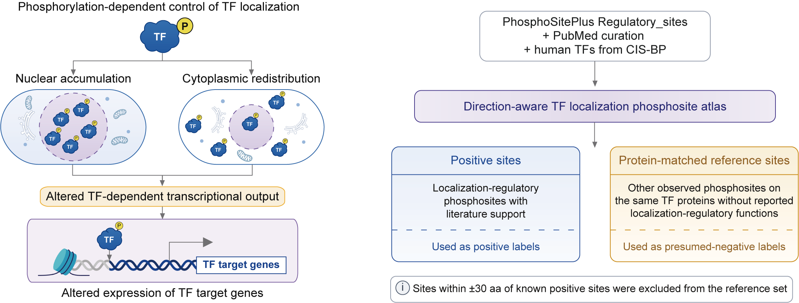

# PhosLoc-Transport

PhosLoc-Transport is a two-stage framework for prioritizing transcription factor phosphosites that may regulate nuclear transport. The Localization-Regulatory Classifier integrates local sequence, central phosphosite, and AlphaFold-derived structural features to identify candidate localization-regulatory sites; the Localization Direction Classifier predicts whether candidate sites are associated with nuclear accumulation or cytoplasmic redistribution.



This monorepo contains **three analysis modules**:

| Subproject | Task |
|------------|------|
| [`functional/`](functional/) | Localization-Regulatory Classifier |
| [`import_export/`](import_export/) | Localization Direction Classifier |
| [`cptac_analysis/`](cptac_analysis/) | CPTAC validation of predicted nuclear accumulation-associated phosphosites |

Typical workflow:

1. Use the Localization-Regulatory Classifier to score whether a TF phosphosite is likely to regulate nuclear transport.
2. Use the Localization Direction Classifier on transport-positive candidate sites to classify nuclear accumulation versus cytoplasmic redistribution.
3. Use CPTAC validation to evaluate predicted nuclear accumulation-associated sites against tumor multi-omics target-gene regulation.

## Requirements

- **Python** 3.9.18 (tested in conda env `phosloc`)
- **Dependencies** ([`requirements.txt`](requirements.txt)): `numpy==2.0.2`, `pandas==2.2.2`, `scipy==1.13.1`, `scikit-learn==1.6.1`, `matplotlib==3.9.4`, `seaborn==0.13.2`, `PyYAML==6.0.2`, `joblib==1.4.2`, `tqdm==4.67.1`, `xgboost==2.1.4`, `torch==2.6.0`, `torch-geometric==2.6.1` (GPU training validated with `torch==2.6.0+cu124`, CUDA 12.4)
- **GPU** acceleration is recommended for ESM embedding extraction and AlphaFold graph-based model training. Prediction and training entry points accept `--device auto`, `cuda`, or `cpu`; `auto` selects CUDA when available and otherwise uses CPU.

Optional dependencies are documented as commented lines in [`requirements.txt`](requirements.txt). Uncomment only the packages needed for your workflow, then rerun `pip install -r requirements.txt`.

## Quick start

```bash
cd phosloc-transport
conda activate phosloc
pip install -r requirements.txt
# optional: uncomment the needed lines in requirements.txt, then rerun pip install -r requirements.txt
```

Place or symlink local data under `functional/data/`, `import_export/data/`, and `cptac_analysis/data/` as needed (see [Data availability](#data-availability)).
New training, prediction, and plotting outputs are written to each subproject's `results/` directory.

### Predict new phosphosites

The default prediction input is `functional/data/dataset_phos_site/tf_all_phos_site_for_prediction.csv`. For a custom CSV, provide at least:

| Column | Description |
|--------|-------------|
| `ACC_ID` | UniProt accession or the accession key used in the FASTA / embedding files |
| `POSITION` | 1-based phosphosite residue position |
| `INDEX` | Stable row/site identifier; recommended for joining outputs |
| `FULL_SEQUENCE` | Optional protein sequence; if absent, the scripts attach it from `--fasta_path` |

Rows with missing sequences, invalid positions, non-STY sites, missing ESM embeddings, or unavailable AlphaFold/PDB positions may be dropped during preprocessing. Dropped-row reports are written when supported by the script options.

Run Localization-Regulatory Classifier prediction:

```bash
cd functional
export PYTHONPATH="${PWD}:${PYTHONPATH}"

python scripts/predict_functional_transport.py \
  --input_csv data/dataset_phos_site/tf_all_phos_site_for_prediction.csv \
  --output_csv results/2_1_functional_classifier_results/predictions/custom_functional_predictions.csv \
  --device cpu \
  --with-threshold
```

Main output columns include per-fold probabilities (`prob_fold_*`), `mean_prob`, `std_prob`, and, when `--with-threshold` is used, `final_threshold` and `pred_label`.

Run direction prediction on transport-positive candidate sites:

```bash
cd import_export
export PYTHONPATH="${PWD}:${PYTHONPATH}"

python scripts/predict_import_export_direction.py \
  --input_csv ../functional/data/dataset_phos_site/tf_all_phos_site_for_prediction.csv \
  --output_csv results/1_transport_classifier_results/esm_window_only_import_pos_predictions/custom_import_export_predictions.csv \
  --device cpu \
  --save_dropped_csv results/1_transport_classifier_results/esm_window_only_import_pos_predictions/custom_dropped_rows.csv
```

Main output columns include `mean_prob_import`, `std_prob_import`, `mean_prob_export`, `std_prob_export`, `threshold`, `pred_label`, and `pred_direction`. The script also writes a per-fold prediction table (`*_per_fold.csv`) and run metadata (`*_run_meta.json`). Platt calibration is enabled by default when `platt_calibrator.json` is present.

### Train functional transport

```bash
cd functional
export PYTHONPATH="${PWD}:${PYTHONPATH}"

python scripts/1_1_run_experiment.py \
  --experiment_cfg configs/experiments/esm_window_site_pdb.yaml \
  --output_tag "ESM Window+Site+PDB"
```

### Train import vs. export

```bash
cd import_export
export PYTHONPATH="${PWD}:${PYTHONPATH}"

python scripts/run_import_export_experiment.py \
  --experiment_cfg configs/experiments/import_export_esm_window_only_supcon_ce_import_pos.yaml \
  --output_tag esm_window_only_supcon_ce_import_pos
```

### Run CPTAC validation

See **[cptac_analysis/README.md](cptac_analysis/README.md)** for data setup (`cptac_analysis/data/source/`), `pyensembl`, and analysis commands.

## Data availability

Large feature files, model artifacts, CPTAC source files, and intermediate data are **not** tracked in Git. Prepare or symlink local data directories according to the data README files in each subproject:

- [`functional/data/README.md`](functional/data/README.md)
- [`import_export/data/README.md`](import_export/data/README.md)
- [`cptac_analysis/data/README.md`](cptac_analysis/data/README.md)

Full inventory and upload notes: **[DATA.md](DATA.md)**.

The processed data bundles and model artifacts are available from Zenodo:
[`10.5281/zenodo.21064685`](https://doi.org/10.5281/zenodo.21064685).
Download the required archive(s) from the Zenodo record and extract them from
the repository root so the bundled top-level paths restore the expected
`functional/data/`, `import_export/data/`, and `cptac_analysis/data/source/`
directories.

| Data bundle | Target path | Download / DOI |
|-------------|-------------|----------------|
| Functional training, prediction, and plotting data | `functional/data/` | [Zenodo DOI: 10.5281/zenodo.21064685](https://doi.org/10.5281/zenodo.21064685) |
| Nuclear accumulation / cytoplasmic redistribution training, prediction, and plotting data | `import_export/data/` | [Zenodo DOI: 10.5281/zenodo.21064685](https://doi.org/10.5281/zenodo.21064685) |
| CPTAC / ChIP / regulon source bundle | `cptac_analysis/data/source/` | [Zenodo DOI: 10.5281/zenodo.21064685](https://doi.org/10.5281/zenodo.21064685) |

Reproducing the finalized runs requires processed feature files, training splits, model configs, and run metadata snapshots bundled under each subproject's `data/` and `configs/` trees. Without the data bundles, the repository can be inspected but training, prediction, plotting, and CPTAC analysis will not run end to end.

## Repository layout

```text
phosloc-transport/
|-- DATA.md                      # complete data inventory
|-- requirements.txt             # core dependencies; optional packages are commented
|-- docs/
|-- scripts/                     # populate_data.sh (data migration helper)
|-- functional/
|   |-- data/                    # functional inputs (+ model_artifacts, precomputed)
|   |-- scripts/
|   |-- configs/
|   |-- src/
|   `-- results/                 # runtime outputs (optional)
|-- import_export/
|   |-- data/
|   |-- scripts/
|   |-- configs/
|   |-- src/
|   `-- results/
`-- cptac_analysis/
    |-- data/                    # CPTAC / ChIP / regulon inputs
    |-- scripts/
    `-- results/                 # integrated pipeline + boxplot outputs
```

## Reproducibility

The finalized training runs are recorded below.

| Pipeline | Original run |
|----------|--------------|
| Localization-Regulatory Classifier | `run_20260610_204935_ESM Window+Site+PDB` |
| Localization Direction Classifier | `run_20260612_125646_esm_window_only_supcon_ce_import_pos` |
| CPTAC validation | `results/import_target_regulation/` (see [cptac_analysis/README.md](cptac_analysis/README.md)) |

Run metadata snapshots for Stages 1-2 are stored under each subproject's `configs/runs/` directory.

## Documentation

| Resource | Description |
|----------|-------------|
| [docs/TRAINING_RUNS.md](docs/TRAINING_RUNS.md) | Full reproduction details and hyperparameters |
| [docs/FIGURES_AND_PREDICTION.md](docs/FIGURES_AND_PREDICTION.md) | Figure and prediction scripts |
| [DATA.md](DATA.md) | Train / plot / predict data layout |
| [functional/README.md](functional/README.md) | Localization-Regulatory Classifier overview |
| [import_export/README.md](import_export/README.md) | Localization Direction Classifier overview |
| [cptac_analysis/README.md](cptac_analysis/README.md) | CPTAC validation overview |

## Troubleshooting

- Use `--device cpu` on machines without a CUDA-capable GPU.
- Check that `ACC_ID` values match the FASTA, ESM embedding filenames, and AlphaFold/PDB files.
- For Localization-Regulatory Classifier prediction, use `--skip_pdb_position_filter` only when you intentionally want to bypass the PDB-position availability check.
- For CPTAC validation, install `pyensembl` and prepare the Ensembl release cache before running the integrated CPTAC pipeline.
- Paths in config files are relative to each subproject root unless stated otherwise.

## Citation

Associated manuscript: **A direction-aware framework links transcription factor phosphosites to localization and transcriptional output**.

If you use PhosLoc-Transport, please cite the associated manuscript once available.
For the accompanying processed data and model artifacts, cite the Zenodo record:
[`10.5281/zenodo.21064685`](https://doi.org/10.5281/zenodo.21064685).

## License

The source code in this repository is licensed under the MIT License. See [LICENSE](LICENSE) for details.

Processed data released separately through Zenodo is licensed under the license specified in the corresponding Zenodo record, except for third-party resources that remain subject to their original terms.

Data bundles may contain or be derived from third-party resources, including CPTAC, LinkedOmicsKB, ChIP-Atlas, CollecTRI, UniProt, AlphaFold, and Ensembl-derived files. Users are responsible for complying with the licenses and terms of use of the original data providers.
