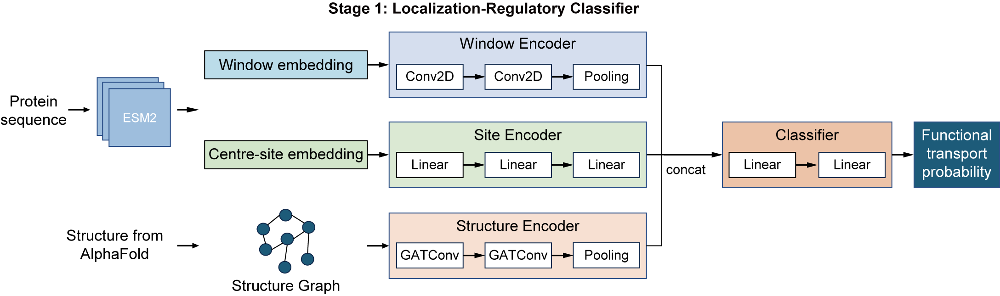

# Functional transport classifier

Stage 1 training and inference pipeline for the PhosLoc-Transport repository.



This subproject trains a binary classifier that predicts whether a transcription factor phosphosite is likely to have **functional nuclear transport regulatory activity**, compared with background phosphosites. It does **not** predict nuclear accumulation versus cytoplasmic redistribution direction; direction classification is handled by the [`import_export/`](../import_export/) subproject.

## Finalized model

| Field | Value |
|-------|-------|
| Task | Functional transport phosphosite classification |
| Feature set | `esm_graph` - ESM-2 local window (31), center-site embedding from the same window block, and AlphaFold local graph features |
| Classifier | `esm_cnn2d_site_gnn` |
| Window size | 31 |
| Original run directory | `results/run_20260610_204935_ESM Window+Site+PDB/Functional_Transport/` |
| Run metadata | [`configs/runs/esm_window_site_pdb_run_meta.json`](configs/runs/esm_window_site_pdb_run_meta.json) |

## Predict new sites

The default prediction input is `data/dataset_phos_site/tf_all_phos_site_for_prediction.csv`. For custom inputs, provide at least `ACC_ID` and `POSITION`; `INDEX` is recommended as a stable site identifier. If `FULL_SEQUENCE` is absent, the script attaches sequences from `--fasta_path`.

```bash
cd functional
export PYTHONPATH="${PWD}:${PYTHONPATH}"

python scripts/predict_functional_transport.py \
  --input_csv data/dataset_phos_site/tf_all_phos_site_for_prediction.csv \
  --output_csv results/2_1_functional_classifier_results/predictions/custom_functional_predictions.csv \
  --device cpu \
  --with-threshold
```

Important options:

| Option | Description |
|--------|-------------|
| `--artifact_root` | Directory containing saved fold artifacts and `model_checkpoint.pt` files |
| `--input_csv` | Input phosphosite table |
| `--output_csv` | Prediction CSV path |
| `--fasta_path` | FASTA used when `FULL_SEQUENCE` is missing |
| `--device` | Use `cuda` or `cpu` |
| `--with-threshold` | Add `final_threshold` and `pred_label` columns |
| `--skip_pdb_position_filter` | Skip filtering rows that lack the required AlphaFold/PDB residue position |

Output columns include the original/transformed site columns, `prob_fold_*`, artifact metadata columns, `mean_prob`, `std_prob`, and optionally `final_threshold` and `pred_label`. Rows dropped by the PDB-position filter are written beside the output as `*_dropped_pdb_rows.csv`.

## Train

```bash
cd functional
export PYTHONPATH="${PWD}:${PYTHONPATH}"

python scripts/1_1_run_experiment.py \
  --experiment_cfg configs/experiments/esm_window_site_pdb.yaml \
  --output_tag "ESM Window+Site+PDB"
```

## Config files

| File | Description |
|------|-------------|
| `configs/experiments/esm_window_site_pdb.yaml` | Experiment entry point: data paths, linked config files, and runtime settings (`device`, `output_dir`) |
| `configs/split.yaml` | Predefined held-out test split and 5-fold stratified group cross-validation on the development set |
| `configs/train.yaml` | `esm_cnn2d_site_gnn` architecture, optimization, and early-stopping settings |
| `configs/feature_sets.yaml` | Feature block definitions used by `esm_graph`: ESM-2 window embeddings, center-site embedding derived by the loader, and AlphaFold graph inputs |
| `configs/runs/esm_window_site_pdb_run_meta.json` | Snapshot of metrics, fold selection, and paths from the finalized run |

## Data

Large feature files, model artifacts, and intermediate inputs are **not** tracked in Git. Prepare or symlink the required files under `functional/data/` before training or prediction. See [`data/README.md`](data/README.md) and [`../DATA.md`](../DATA.md) for the expected directory layout.

Required prediction resources:

| Resource | Default path |
|----------|--------------|
| Input site CSV | `data/dataset_phos_site/tf_all_phos_site_for_prediction.csv` |
| FASTA | `data/fasta/transcription_fasta.fasta` |
| ESM embeddings | `data/TF_esm_embedding/` |
| AlphaFold/PDB files | `data/alphafold_tf_pdb/` |
| Model artifacts | `data/model_artifacts/run_20260610_204935_ESM Window+Site+PDB/Functional_Transport/artifacts/` |

## Outputs

Training writes model checkpoints, validation metrics, test metrics, and run metadata to the configured results directory (default: `results/`). The finalized run is stored at:

```text
results/run_20260610_204935_ESM Window+Site+PDB/Functional_Transport/
```

Prediction writes ensemble probability tables to:

```text
results/2_1_functional_classifier_results/predictions/
```

## Notes and limitations

- The positive class is a functional nuclear-transport regulatory phosphosite.
- The model was developed for transcription-factor phosphosites and expects matching sequence, embedding, and structure resources.
- Use the direction classifier (`../import_export/`) to classify nuclear accumulation versus cytoplasmic redistribution after identifying transport-positive candidate sites.

## Related documentation

| Resource | Description |
|----------|-------------|
| [../docs/TRAINING_RUNS.md](../docs/TRAINING_RUNS.md) | Full reproduction details and hyperparameters |
| [../docs/FIGURES_AND_PREDICTION.md](../docs/FIGURES_AND_PREDICTION.md) | Figure and prediction scripts |
| [data/README.md](data/README.md) | Local data layout and file inventory |
