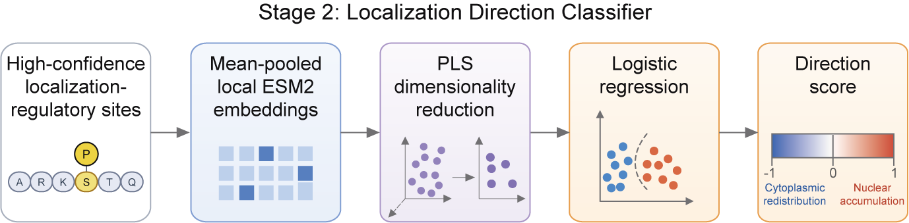

# Localization Direction Classifier

Localization Direction Classifier training and inference pipeline for the PhosLoc-Transport repository.



This subproject trains a binary classifier that predicts **nuclear accumulation versus cytoplasmic redistribution** among annotated transport-positive transcription factor phosphosites. Historical model labels and file paths use `Import` as the positive class and `Export` as the negative class. It does **not** classify functional transport activity against background phosphosites; that task is handled by the [`functional/`](../functional/) subproject.

Default commands use the manuscript v11 Stage 1 and D3 Stage 2 runs. Earlier runs are retained as legacy versions.

## Finalized model

| Field | Value |
|-------|-------|
| Task | Localization direction classification: nuclear accumulation vs. cytoplasmic redistribution |
| Label convention | Legacy labels: Import = 1, Export = 0 |
| Feature set | ESM window-41 + site, **kernel-PLS** (D3; feature key still named `esm_window_only_supcon_ce`) |
| Output tag | `ie147_R3D_D3_kpls_gauto` |
| Model | `supcon_ce` on D3 reduced features |
| Window size | 41 |
| Labeled sites | **147** Import/Export positives |
| Original run directory | `results/run_20260904_134712_ie147_R3D_D3_kpls_gauto/Import_vs_Export/` |
| Joint scores | `data/precomputed/1_transport_classifier_results/joint_score_v11_147pos_d3_platt/` |
| Run metadata | [`configs/runs/ie147_R3D_D3_kpls_gauto_run_meta.json`](configs/runs/ie147_R3D_D3_kpls_gauto_run_meta.json) |

## Predict new sites

Run this model on transport-positive candidate sites, typically after Localization-Regulatory Classifier prediction. The default prediction input is `../functional/data/dataset_phos_site/tf_all_phos_site_for_prediction.csv`. For custom inputs, provide at least `ACC_ID` and `POSITION`; `INDEX` is recommended as a stable site identifier.

```bash
cd import_export

python scripts/predict_import_export_direction.py \
  --input_csv ../functional/data/dataset_phos_site/tf_all_phos_site_for_prediction.csv \
  --output_csv results/1_transport_classifier_results/d3_kpls_gauto_predictions_platt/custom_import_export_predictions.csv \
  --device cpu \
  --save_dropped_csv results/1_transport_classifier_results/d3_kpls_gauto_predictions_platt/custom_dropped_rows.csv
```

Important options:

| Option | Description |
|--------|-------------|
| `--input_csv` | Input phosphosite table |
| `--fasta_path` | FASTA used to attach `FULL_SEQUENCE` |
| `--run_dir` | Saved fold artifacts and Platt calibrator |
| `--output_csv` | Ensemble prediction CSV path |
| `--device` | Use `auto`, `cuda`, or `cpu`; `auto` selects CUDA when available and otherwise uses CPU |
| `--threshold` | Override decision threshold on `mean_prob_positive` |
| `--save_dropped_csv` | Save rows dropped during preprocessing |
| `--use_platt` / `--no-use_platt` | Enable or disable Platt calibration when the calibrator exists |

Main output columns include `mean_prob_import`, `std_prob_import`, `mean_prob_export`, `std_prob_export`, `threshold`, `positive_class`, `pred_label`, `pred_direction`, `feature_set`, and `model_name`. In these legacy column names, `import` corresponds to nuclear accumulation and `export` corresponds to cytoplasmic redistribution. The script also writes:

| Output | Description |
|--------|-------------|
| `*_per_fold.csv` | Wide table of fold-level direction probabilities |
| `*_run_meta.json` | Input paths, feature set, calibration status, threshold, and preprocessing counts |
| dropped-row CSV | Optional table containing sites removed for missing sequence, invalid position, non-STY residue, or missing ESM embedding |

## Joint score and stable predictions

`scripts/calculate_joint_direction_score.py` combines Localization-Regulatory Classifier ensemble scores with direction predictions. Defaults point at the **v11 + D3 + Platt** inputs. Manuscript-aligned stable tables live under:

```text
data/precomputed/1_transport_classifier_results/joint_score_v11_147pos_d3_platt/
```

Export stability uses `direction_score_mu <=` known-export threshold (aligned with Methods), plus ≥4 fold votes and `mu <` global median.

```bash
# Defaults already target v11 functional + D3 Platt direction predictions
python scripts/calculate_joint_direction_score.py \
  --functional_score_threshold 0.6 \
  --min_vote 4
```

The reference stable files use probability and fold-vote filters encoded in the filename, for example `predicted_import_stable_gt0p6_vote4.csv` means sites passing the selected score threshold (`gt0p6`) and at least four supporting fold votes (`vote4`).

## Train

```bash
cd import_export

python scripts/run_import_export_experiment.py \
  --experiment_cfg configs/experiments/import_export_ie147_D3_kpls_gauto.yaml \
  --output_tag ie147_R3D_D3_kpls_gauto
```

## Config files

| File | Description |
|------|-------------|
| `configs/experiments/import_export_ie147_D3_kpls_gauto.yaml` | **Default** manuscript experiment (D3 kernel-PLS) |
| `configs/feature_sets_d3_kpls_gauto.yaml` / `train_d3_kpls_gauto.yaml` | D3 features and SupCon+CE HPs |
| `configs/runs/ie147_R3D_D3_kpls_gauto_run_meta.json` | Snapshot from the finalized D3 run |
| `configs/experiments/import_export_esm_window_only_supcon_ce_import_pos.yaml` | Legacy PLS-64 / window-21 baseline |
| `configs/split.yaml` | 5-fold stratified group cross-validation |

## Data

Large feature files, model artifacts, and intermediate inputs are **not** tracked in Git. Prepare or symlink the required files under `import_export/data/` before training or prediction; some inputs are shared with or copied from `functional/data/`. See [`data/README.md`](data/README.md) and [`../DATA.md`](../DATA.md) for the expected directory layout.

Required prediction resources:

| Resource | Default path |
|----------|--------------|
| Input site CSV | `../functional/data/dataset_phos_site/tf_all_phos_site_for_prediction.csv` |
| FASTA | `data/fasta/transcription_fasta.fasta` |
| ESM embeddings | `data/TF_esm_embedding/` |
| Model artifacts | Zenodo pack → D3 run `fold_artifacts/` under `results/run_20260904_134712_ie147_R3D_D3_kpls_gauto/` |
| Platt calibrator | Beside D3 prediction outputs (`d3_kpls_gauto_predictions_platt/`) |

## Outputs

Training writes model checkpoints, fold-level metrics, cross-validation summaries, and run metadata to the configured results directory (default: `results/`). The finalized run is stored at:

```text
results/run_20260904_134712_ie147_R3D_D3_kpls_gauto/Import_vs_Export/
```

Prediction writes ensemble and per-fold tables to:

```text
results/1_transport_classifier_results/d3_kpls_gauto_predictions_platt/
```

## Notes and limitations

- This model assumes the input sites are plausible transport-regulatory candidates.
- The reference positive class is the legacy import label, corresponding to nuclear accumulation; if a future run uses the legacy export label as the positive class, interpret `mean_prob_positive` through the `positive_class` column.
- Platt-calibrated probabilities are used when the saved calibrator is available and `--use_platt` is enabled.

## Related documentation

| Resource | Description |
|----------|-------------|
| [../docs/TRAINING_RUNS.md](../docs/TRAINING_RUNS.md) | Full reproduction details and hyperparameters |
| [../docs/FIGURES_AND_PREDICTION.md](../docs/FIGURES_AND_PREDICTION.md) | Figure and prediction scripts |
| [data/README.md](data/README.md) | Local data layout and file inventory |
